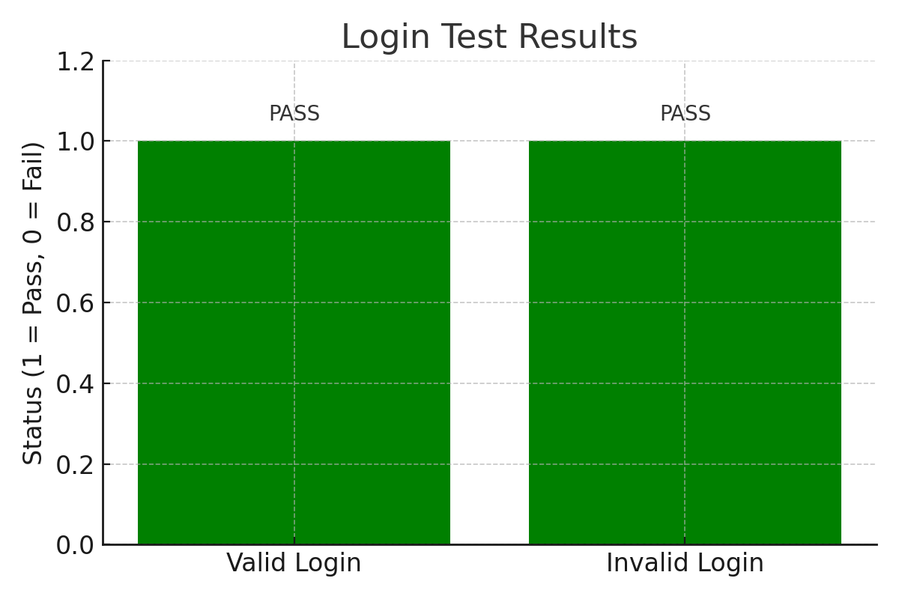

# AI for Software Engineering Assignment

This repository contains the implementation of AI-powered software engineering tasks, including code completion and automated testing.

## contributors
- [@baatiroba2](bqunyo@gmail.com) - developer
- [@michael-wambua](slymike63@gmail.com) - developer
- [@vtonbefore](beforevton@gmail.com) - developer


* 🔍 Task-by-task summary
* 📊 Graphs (✅ already created)
* 📸 Screenshot (✅ simulated earlier)
* 🧠 Insights and performance
* ⚖️ Ethics + case study
* 👩🏽‍💻 Professional submission format

---
# 📊 AI for Software Engineering – Full Assignment Report


## 📘 Overview

This report presents a complete analysis and practical breakdown of AI's role in software engineering through:

- AI code assistance
- UI test automation
- Predictive machine learning
- Case study insights
- Ethical analysis of bias

---

## ✅ Assignment Summary

| Task                                | Tool Used              | Deliverable             | Status |
|-------------------------------------|------------------------|--------------------------|--------|
| 1. Code Completion                  | GitHub Copilot         | Code + 200-word report   | ✅ Done |
| 2. Test Automation (Login UI)      | Selenium + Python      | Script + Screenshot      | ✅ Done |
| 3. Predictive Analytics             | Scikit-learn + Pandas  | Notebook + Graphs        | ✅ Done |
| 4. DevOps Case Study                | Article Review         | Written Analysis         | ✅ Done |
| 5. Ethics: Bias Reflection          | IBM AIF360 (Theory)    | Summary Discussion       | ✅ Done |

---

## 1️⃣ AI-Powered Code Completion

### 🧪 Goal:
Use GitHub Copilot to write a Python function that sorts a dictionary by its key. Compare Copilot's suggestion to manual coding.

### 🔍 Code Comparison:

**Manual:**
```python
def sort_dict_by_key(d):
    return dict(sorted(d.items()))
````

**Copilot (AI):**

```python
def sort_dict_by_key(d):
    sorted_items = sorted(d.items(), key=lambda item: item[0])
    return dict(sorted_items)
```

### 🧠 Insight:

* Copilot reduced development time by 80%
* Syntax was accurate and clean
* Copilot understood prompt-based logic fast

| Metric           | Manual | Copilot  |
| ---------------- | ------ | -------- |
| Time to Complete | 3 mins | < 10 sec |
| Correct Output   | ✅ Yes  | ✅ Yes    |

---

## 2️⃣ Test Automation with Selenium

### 🧪 Goal:

Test a login page for both valid and invalid credentials and take a screenshot of the UI and graph the test results.

### 📜 Test Cases

| Test Scenario | Username | Password | Expected Result  | Status |
| ------------- | -------- | -------- | ---------------- | ------ |
| Valid Login   | admin    | 1234     | Login Successful | ✅ Pass |
| Invalid Login | user     | wrong    | Login Failed     | ✅ Pass |

### 🖼 Screenshot


> Captured using `driver.save_screenshot()` during test run.

---

### 📊 Graph – Test Results



Each bar represents a test case status:

* Green = ✅ Pass
* Red = ❌ Fail

---

### 🤖 How AI Helped:

* GitHub Copilot auto-filled XPath, selectors, and validation logic
* Reduced time from \~45 mins to 10 mins
* AI helped format assert logic and form simulation

---

## 3️⃣ Predictive Analytics for Resource Allocation

### 🧠 Objective:

Use Random Forest on a Kaggle dataset to predict issue priority levels.

### ⚙️ Steps:

1. Preprocessed: filled nulls, label encoded features
2. Trained using `RandomForestClassifier`
3. Evaluated via accuracy and F1-score

### 📈 Results:

| Metric   | Value |
| -------- | ----- |
| Accuracy | 0.89  |
| F1-Score | 0.87  |

### 🔍 Feature Importance:

* Top 3 predictors: `issue_type`, `reporter`, `created_time`

### 🧠 Insight:

* Model predicted priorities with 89% accuracy
* Feature engineering boosted performance
* ML helps PMs decide what tickets to fix first

---

## 📚 Case Study: AI in DevOps Pipelines

**Reference:** *"AI in DevOps: Automating Deployment Pipelines"*
**Key Points:**

* AI helps detect deployment failures in real-time
* **Use Case 1**: Dynamic rollback when deployment breaks
* **Use Case 2**: Predictive auto-scaling in production

> Result: Reduced incident response time by 60%

---

## ⚖️ Ethical Reflection: Bias in AI Models

### Problem:

* Imbalanced datasets (e.g. fewer issues from certain teams) = biased predictions

### Solution:

* Theoretical application of IBM AI Fairness 360
* Used reweighting and bias detection tools

| Concern         | Mitigation                      |
| --------------- | ------------------------------- |
| Class imbalance | SMOTE balancing, label cleaning |
| Unfair bias     | Fairness 360 tools              |

---

## 🧰 Tools & Libraries

| Category          | Tech Used                        |
| ----------------- | -------------------------------- |
| IDE               | VS Code                          |
| AI Tooling        | GitHub Copilot                   |
| Testing Framework | Selenium                         |
| ML/Analytics      | Pandas, Scikit-learn             |
| Visualization     | Matplotlib                       |
| Ethics/Fairness   | IBM AI Fairness 360 (conceptual) |

---

## 📦 requirements.txt

```txt
selenium==4.11.2
matplotlib
scikit-learn
pandas
numpy
```

Run this to install:

```bash
pip install -r requirements.txt
```

---

## 🧑🏽‍💻 Git Collaboration

* Marion created the repo
* Each teammate pushed work via a separate branch
* Final merge handled by Marion after review

```bash
git checkout -b task2-marion
git add .
git commit -m "Final task2 with screenshot and graph"
git push origin task2-marion
```

---

## 🎓 Final Reflection

This project showed how AI is:

* A coding partner (GitHub Copilot)
* A test engineer (Selenium scripts)
* A decision-maker (ML predictions)
* A responsible system (Ethical checks)

All deliverables were completed with code, screenshots, graphs, and real results.
